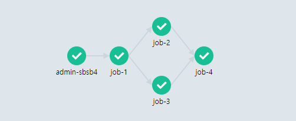

# jupyterflow

Run your workflow on JupyterHub!

## What is jupyterflow?

Run [Argo Workflow](https://argoproj.github.io/argo) pipeline on [JupyterHub.](https://jupyter.org/hub)

- No Kubernetes knowledge (YAML) needed to run.
- No container build & push or deploy.
- Just run workflow with single command `jupyterflow`.

`jupyterflow` is a command that helps user utilize Argo Workflow engine without making YAML files or building containers on JupyterHub.

The following `jupyterflow` command will make sequence workflow.

```bash
jupyterflow run -c "python input.py >> python train.py"
```


## Get Started

Although using `jupyterflow` does not require Kubernetes knowledge, you need to know Kubernetes to `jupyterflow` to work. If you're familiar with Kubernetes, it will not be too hard. 

This project only works on [JupyterHub for Kubernetes.](https://zero-to-jupyterhub.readthedocs.io/en/latest)

### 1. Install Kubernetes

Any Kubernetes distributions will work. `Zero to JupyterHub` has a wonderful [guide for setting up Kubernetes.](https://zero-to-jupyterhub.readthedocs.io/en/latest/#setup-kubernetes) 

### 2. Install JupyterHub

Also, follow the [`Zero to JupyterHub` instruction to set up JupyterHub.](https://zero-to-jupyterhub.readthedocs.io/en/latest/#setup-jupyterhub)

// There is one thing you should configure to use jupyterflow.
There is one thing you should be aware of while installing jupyterflow.

#### Specify serviceAccoutName

You need to specify `serviceAccoutName` in `config.yaml`. This service account will be used to create  Argo `Workflow` object on behalf of you.
For example, use `default` service account. Later, you should grant this service account to create `Workflow` object.

```yaml
# config.yaml
singleuser:
  serviceAccountName: default
```

### 3. Install Argo Workflow

Install Argo workflow with this [page](https://argoproj.github.io/argo/quick-start) You need to install Argo workflow in the **same Kubernetes namespace** where JupyterHub is installed.

For example, using `jupyterflow` namespace for JupyterHub and Argo Workflow.

```bash
# create namespace jupyterflow
kubectl create ns jupyterflow

# install jupyterhub in jupyterflow
helm install jupyterhub jupyterhub/jupyterhub --namespace jupyterflow

# install argo workflow in jupyterflow
kubectl apply --namespace jupyterflow -f \
    https://raw.githubusercontent.com/argoproj/argo/stable/manifests/quick-start-postgres.yaml
```

### 4. Expose Argo Workflow UI (Optional)

Expose Web UI for Argo Workflow: https://argoproj.github.io/argo/argo-server/

You need to expose Argo Web UI to see the result of `jupyterflow`.

### 5. Grant JupyterHub ServiceAccount RBAC

Grant service account used in JupyterHub the ability to create Argo Workflow objects.

#### Options 1)

The simplest way to grant service account is to bind `cluster-admin` role. For example, if you deployed JupyterHub in `jupyterflow` namespace and specify service account as `default`

```bash
# --serviceaccount=<NAMESPACE>:<SERVICE_ACCOUNT>
kubectl create clusterrolebinding jupyterflow-admin \
                        --clusterrole=cluster-admin \
                        --serviceaccount=jupyterflow:default
```

#### Options 2)

For more fine-grained RBAC, create Workflow Role in the namespace where JupyterHub is installed.

```bash
cat << EOF | kubectl create -n jupyterflow -f -
apiVersion: rbac.authorization.k8s.io/v1
kind: Role
metadata:
  name: workflow-role
rules:
# pod get/watch is used to identify the container IDs of the current pod
# pod patch is used to annotate the step's outputs back to controller (e.g. artifact location)
- apiGroups:
  - ""
  resources:
  - pods
  verbs:
  - get
  - watch
  - patch
# logs get/watch are used to get the pods logs for script outputs, and for log archival
- apiGroups:
  - ""
  resources:
  - pods/log
  verbs:
  - get
  - watch
EOF
```

Then, bind Role with your service account. For example, binding `default` service account in `jupyterflow` namespace.

```bash
kubectl create rolebinding workflow-rb \
                      --role=workflow-role \
                      --serviceaccount=jupyterflow:default \
                      -n jupyterflow
```

You might want to look at [https://argoproj.github.io/argo/service-accounts](https://argoproj.github.io/argo/service-accounts)

### Install jupyterflow

Finally, install `jupyterflow` using pip.

```bash
pip install jupyterflow
```

### Run Workflow

### Run by command

Go to JupyterHub, launch notebook server. Write your own code.

```python
# input.py
print('hello')
```

```python
# train.py
print('world')
```

Run following command for sequence workflow.

```bash
jupyterflow run -c "python input.py >> python train.py"
```

Go to Argo Web UI and check out the output of launched workflow.


### Run by workflow.yaml

If you want to run more sophisticated workflow, such as DAG (Directed Acyclic Graph), write your workflow on file (for example, `workflow.yaml`, the name doen't matter)

```yaml
# workflow.yaml
jobs:
- python input.py 
- python train.py
- python train.py
- python output.py

dags:
- 1 >> 2
- 1 >> 3
- 2 >> 4
- 3 >> 4
```

```python
# output.py
print('again!')
```

Run `jupyteflow` with `-f` option

```bash
jupyterflow run -f workflow.yaml
```

Check out the result.




## How does it work?


`jupyterflow` simply reads jupyter server `Pod` object to get all kinds of metadata, and reconstruct to `Workflow` object.

`jupyterflow` uses following metadata from `Pod`
- Container image
- Environment variables
- Home directory (home `PersistentVolumeClaim`)
- Extra volume mount points
- Resource management (`requests`, `limits`)
- UID, GUID


## `workflow.yaml` file Configuration

```yaml
# workflow.yaml

name: workflow-name

jobs:
- python input.py
- python train.py

dags:
- 1 >> 2

schedule: '*/2 * * * *'
```

| Property  | Description                                                                | Optional  | Default                           |
|-----------|----------------------------------------------------------------------------|-----------|-----------------------------------|
|`name`     | Name of the workflow. This name will used for Argo `Workflow` object name. | Optional  | jupyterflow                       |
|`jobs`     | Jobs to run. Any kinds of command will work. (Not just Python)             | Required  |                                   |
|`dags`     | Job dependencies. Index starts at 1. (`$PREVIOUS_INDEX` >> `$NEXT_INDEX`)  | Optional  | All jobs parallel (No dependency) |
|`schedule` | When to execute this workflow. Follows cron format.                        | Optional  | No schedule                       |
